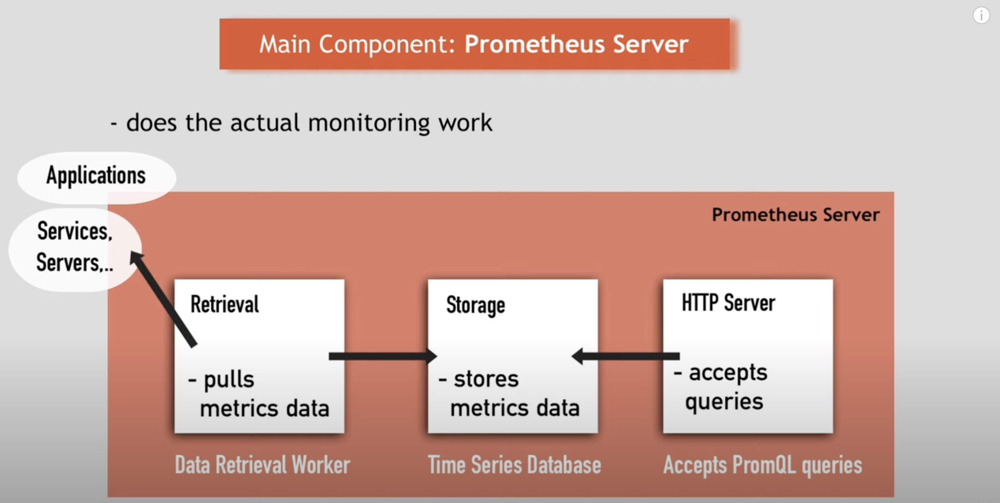
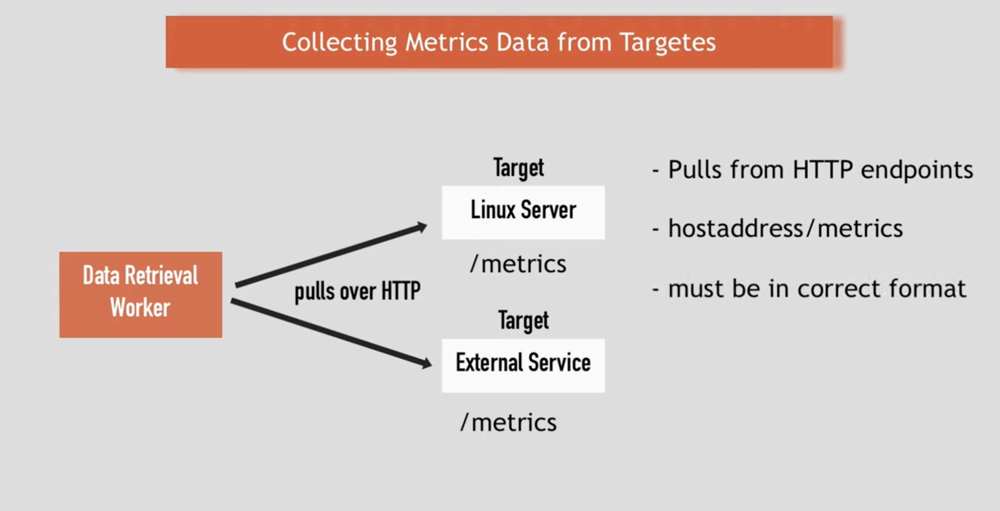
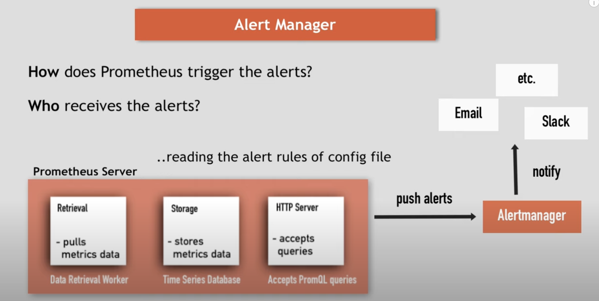
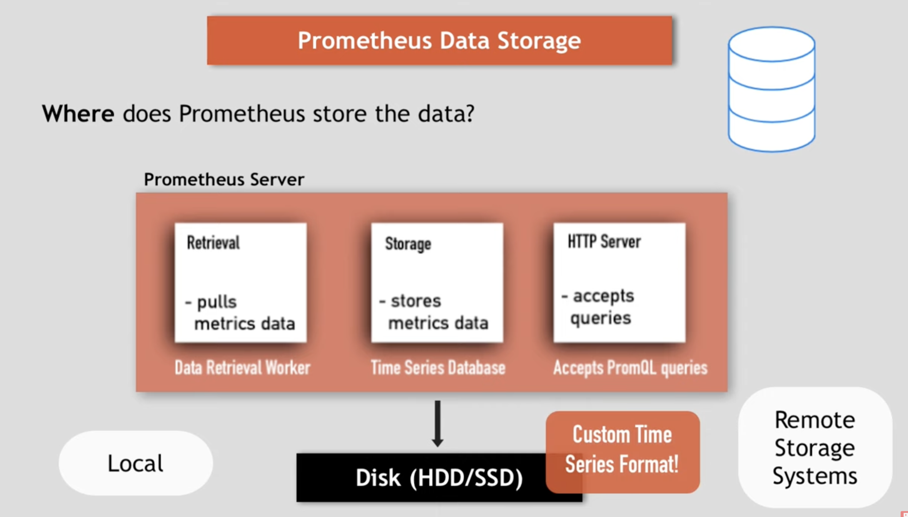

## Download Grafana

```bash
#curl -O https://dl.grafana.com/oss/release/grafana-12.0.2.darwin-amd64.tar.gz
tar -zxvf grafana-12.0.2.darwin-amd64.tar.gz
```

## Run the grafana server

```bash
./bin/grafana-server
```











